# Codosa test
## Feature:
1. Sign up (facebook).
2. Login.
3. KYC: upload custom's ID card image, selfie image.
4. Post: upload youtube link, kind, subject, description,...
5. Admin:
a. Check KYC
b. Check user's post, then decide to render on the website.
## Members:
Duong Vong
## Description:
### Users:
1. When login to web, users can choice to update their imfomation, upload videos, or show all their videos
2. At User infomation page, user can upload his image and upload to web.
3. At User upload video page, user can upload youtube link, which he want and descript it.
4. At User list video page, user can see all the video which he has uploaded, and know which is waiting, accepted to public or ban.
#### Some picture:
1. Home:
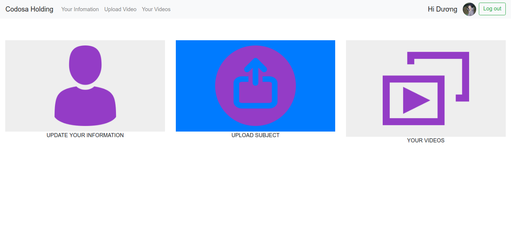
2. User infomation
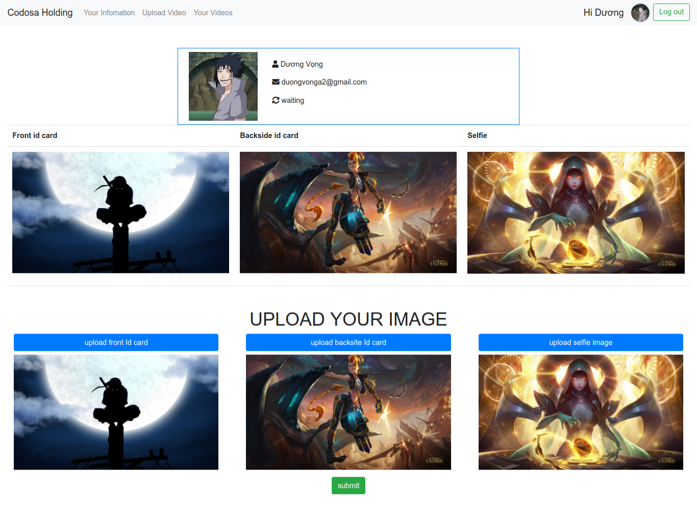
3. User upload video:
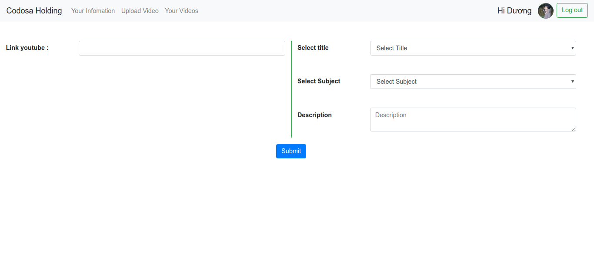
 
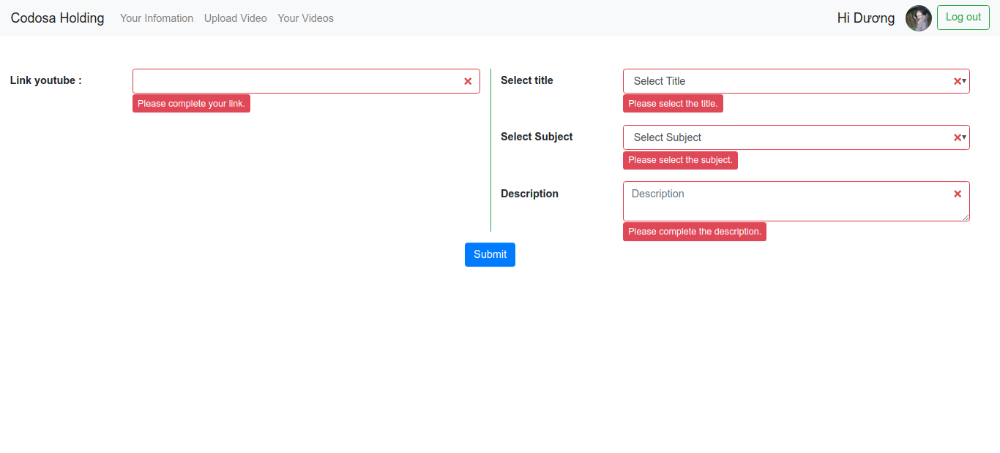
 
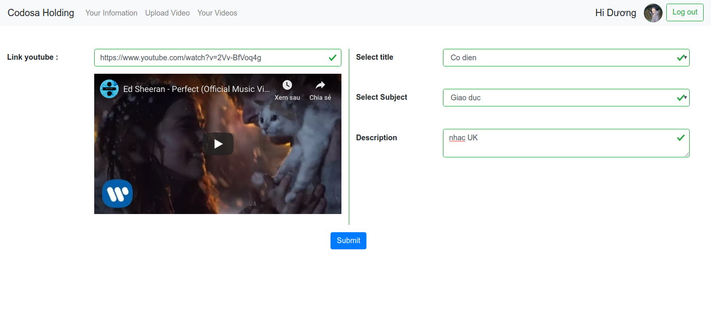
4. User list videos:
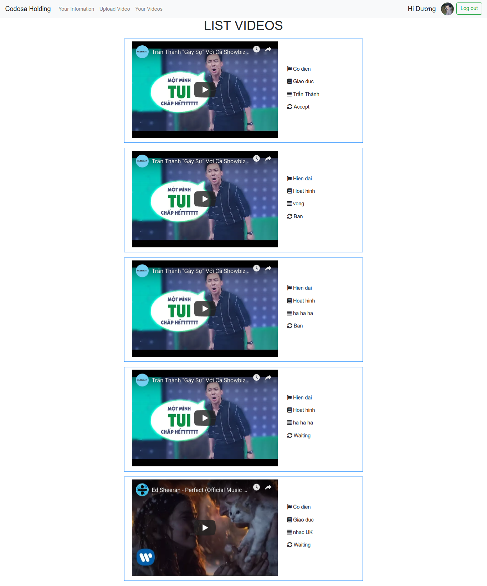

### Admin:
1. When login to web, admin can choice to show list users or list videos.
2. At list users page, admin can show detail infomation of each user who he want.
3. At detail infomation user page, admin can see and decide user's image can show or not.
4. At list video page, admin can show detail video which he want.
5. At detail video page, admin can see and decide which videos is publiced.
#### Some picture:
1. Admin home: 
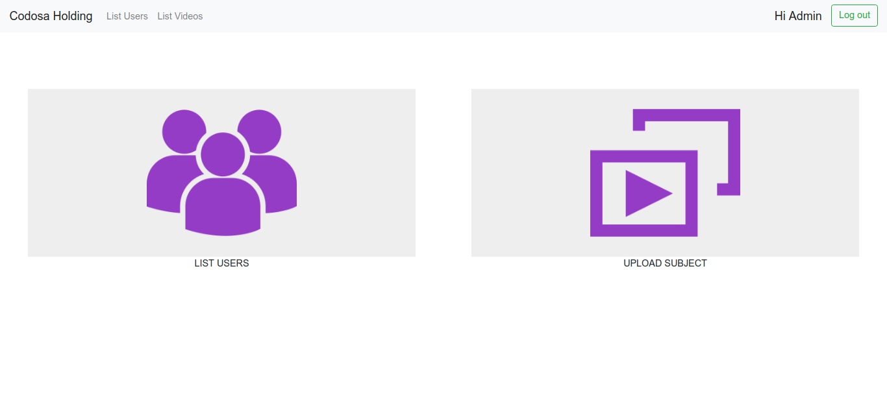
2. Admin list Users:
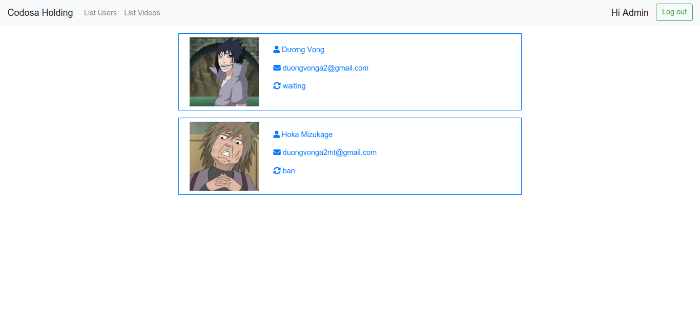
3. Admin user detail:
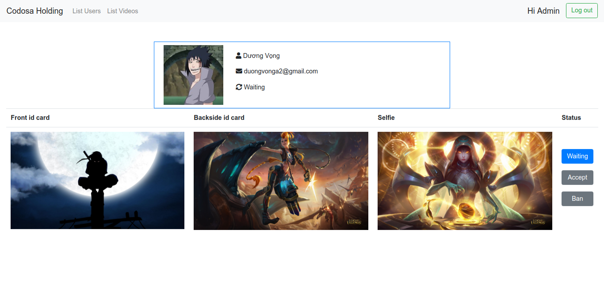
4. Admin list videos :
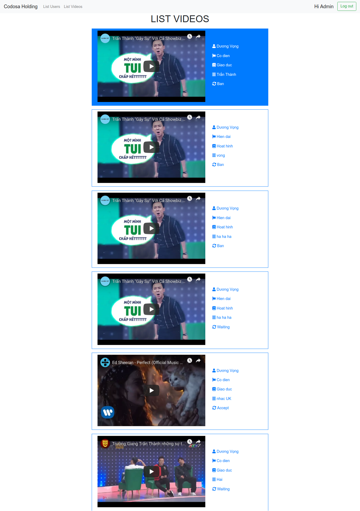
5. Admin video detail:
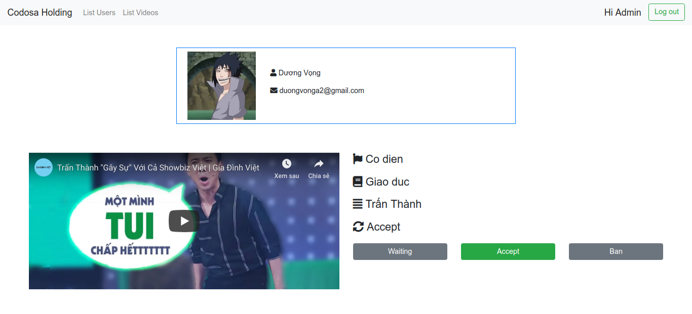
### Video demo:
 - I can't embed youtube video to this file, so i hope you will click to this links to know more detail. Thank you!
 - https://www.youtube.com/watch?v=o-257cUwqmQ&feature=youtu.be